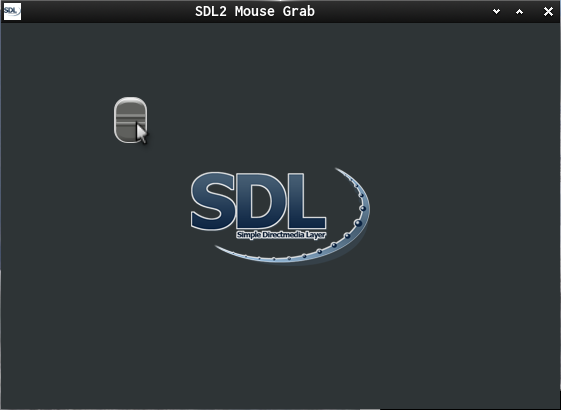

This is a tiny C-SDL2 Demo that moves an entity with the mouse.

It mainly about:  
[SDL_GetMouseState](https://wiki.libsdl.org/SDL_GetMouseState) and uses a bool to toggle the state triggered by mouse events.

Useful links:  
[SDL2](https://www.libsdl.org/) [SDL-Discourse](https://discourse.libsdl.org) [Example Code](https://gist.github.com/Acry/baa861b8e370c6eddbb18519c487d9d8)

Screenshot:  

Assets  
[Button](https://openclipart.org/detail/184819/black-slider)

[Get in touch on SDL-Discourse](https://discourse.libsdl.org/u/Acry/summary)
